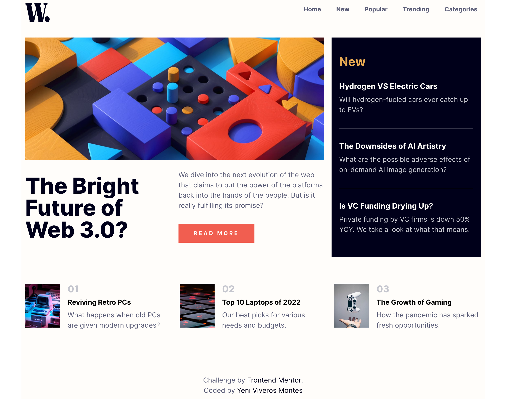

# Frontend Mentor - News homepage solution

This is a solution to the [News homepage challenge on Frontend Mentor](https://www.frontendmentor.io/challenges/news-homepage-H6SWTa1MFl). Frontend Mentor challenges help you improve your coding skills by building realistic projects. 

## Table of contents

- [Overview](#overview)
  - [The challenge](#the-challenge)
  - [Screenshot](#screenshot)
  - [Links](#links)
- [My process](#my-process)
  - [Built with](#built-with)
  - [What I learned](#what-i-learned)
  - [Continued development](#continued-development)
  - [Useful resources](#useful-resources)
- [Author](#author)


## Overview

### The challenge

Users should be able to:

- View the optimal layout for the interface depending on their device's screen size
- See hover and focus states for all interactive elements on the page

### Screenshot




### Links

- Live Site URL: [Netlify](https://project3-dropdownmenu.netlify.app/)

## My process

### Built with

- Semantic HTML5 markup
- CSS custom properties
- Flexbox
- CSS Grid
- Mobile-first workflow
- JavaScript


### What I learned

Here I learned to create a dropdown menu with a pair of simple functions and mixing them with transitions on CSS:

```css
.entrada-menu{
    transition: transform 1s;
    transform: translateX(-270px);
    
}

.salida-menu{
    transition: transform 1s ease-in;
    transform: translateX(270px);
}
```
```js
function abriendoMenu(){
    contenedorNavegacion.classList.remove('salida-menu');
    contenedorNavegacion.classList.add('entrada-menu');

    fondoNavegacion.classList.add('bg-nav');
}

function cerrandoMenu(){
    contenedorNavegacion.classList.remove('entrada-menu');
    contenedorNavegacion.classList.add('salida-menu');

    fondoNavegacion.classList.remove('bg-nav');
}

botonAbriendoMenu.addEventListener('click', abriendoMenu);
botonCerrarMenu.addEventListener('click', cerrandoMenu);
```


### Continued development

On next projects I'd continue focusing to improve my JavaScript habilities as well as Flexbox and CSS Grid. 
I'm trying to improve my logic of thought.


### Useful resources

- [MDN Web Docs](https://developer.mozilla.org/es/docs/Web/API/Element/classList) - This helped me for how to add or remove a class with classList.


## Author

- Website - [Yeni Viveros Montes](https://curriculum-yvm.netlify.app)
- LinkedIn - [Yeni Viveros Montes](https://www.linkedin.com/in/yeni-viveros-montes)


